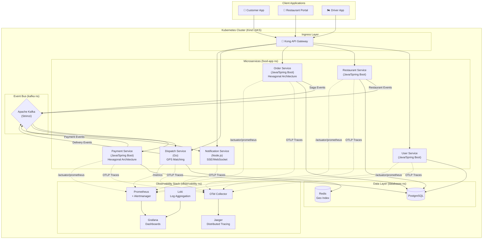

# Food Delivery Microservices Platform

A **production-grade food delivery system** built with **Event-Driven Microservices Architecture**, demonstrating real-world patterns for Kubernetes deployment, GitOps, and full Observability stack.

## Architecture Overview



### Service Matrix

| Service              | Tech                 | Architecture                     | Port |
|----------------------|----------------------|----------------------------------|------|
| User Service         | Java 21 (Spring Boot)| Simplified Layered               | 8001 |
| Restaurant Service   | Java 21 (Spring Boot)| Simplified Layered               | 8002 |
| Order Service        | Java 21 (Spring Boot)| **Hexagonal (Ports & Adapters)** | 8003 |
| Payment Service      | Java 21 (Spring Boot)| **Hexagonal (Ports & Adapters)** | 8004 |
| Dispatch Service     | Go 1.22              | Idiomatic Go (Clean)             | 8005 |
| Notification Service | Node.js 20 (TS)      | Simple Modular                   | 8006 |

**Infrastructure:** Kong API Gateway · Apache Kafka (Strimzi) · PostgreSQL · Redis · ArgoCD (GitOps)

**Observability:** Prometheus + Alertmanager · Grafana · Loki + Promtail · Jaeger · OpenTelemetry

---

## Quick Start

### Option A: Docker Compose (Quick Dev, No K8s)

```bash
# App services only
docker compose up -d

# App + Full Observability Stack
docker compose --profile observability up -d

# Access:
#   Services:   http://localhost:8001-8006
#   Grafana:    http://localhost:3000  (admin/admin)
#   Jaeger:     http://localhost:16686
#   Prometheus: http://localhost:9090
```

### Option B: Kubernetes Local (Full Demo, Recommended)

#### Prerequisites

```bash
# Required tools
docker --version      # Docker 24+
kind version          # v0.23+
kubectl version --client
helm version          # v3.15+
python3 --version     # 3.10+
```

#### 1. Setup Cluster + Infra + Observability

```bash
# Clone
git clone https://github.com/<org>/food-delivery-microservices.git
cd food-delivery-microservices

# Full setup: Kind cluster + PostgreSQL + Redis + Kafka + Kong + Prometheus + Grafana + Loki + Jaeger
make local-setup
```

This takes ~10-15 minutes on first run (downloading Helm charts and images).

#### 2. Deploy Application Services

```bash
# Build and push images to local Kind registry (or use pre-built images)
make helm-deploy
```

#### 3. Access Observability UIs

```bash
# Open ALL observability tools (runs port-forwards in background)
make observe-all

# Or individual tools:
make observe-grafana     # http://localhost:3000  (admin / food-delivery-admin)
make observe-jaeger      # http://localhost:16686
make observe-prometheus  # http://localhost:9090
```

#### 4. Load Sample Data & Test E2E

```bash
make seed          # Load users and restaurants
make e2e-test      # Run full E2E flow (order → payment → dispatch → delivery)
```

#### 5. Check Status

```bash
make k8s-status              # All pods
make observability-status    # Observability pods + ServiceMonitors + Rules
```

---

## Available Make Commands

```bash
# K8s Local
make local-setup          # Full setup (K8s + infra + observability) ~15min
make local-setup-infra    # K8s + infra only (skip observability)
make local-down           # Delete Kind cluster
make k8s-status           # Show all pods

# Deployment
make helm-deploy          # Deploy app services via Helm
make deploy-observability # Deploy/update observability stack

# Observability
make observe-all          # Port-forward ALL tools (Grafana + Jaeger + Prometheus)
make observe-grafana      # → localhost:3000
make observe-jaeger       # → localhost:16686
make observe-prometheus   # → localhost:9090
make observability-status # Show observability pods and configs

# Development
make compose-up           # Docker Compose (quick dev)
make dev svc=order-service# Hot-reload with Skaffold
make logs svc=order-service# Tail logs from K8s

# Testing & Quality
make test svc=order-service
make test-all
make helm-lint            # Validate all Helm charts
make verify-setup         # Full quality gate

# Data
make seed                 # Load sample data
make health-check         # Health check all services
```

---

## Documentation

| Category          | Document                                                          | Description                                        |
|-------------------|-------------------------------------------------------------------|----------------------------------------------------|
| **Architecture**  | [SADD](docs/architecture/SADD.md)                                 | System Architecture Design Document                |
| **Architecture**  | [ADRs](docs/architecture/adr/)                                    | Architecture Decision Records                      |
| **Development**   | [Developer Guide](docs/development/DEVELOPER_GUIDE.md)            | Onboarding, local setup, workflow                  |
| **Development**   | [API Style Guide](docs/development/API_STYLE_GUIDE.md)            | REST conventions, error format, pagination         |
| **Development**   | [Testing Strategy](docs/development/TESTING_STRATEGY.md)          | Testing pyramid, tools, coverage                   |
| **Development**   | [Database Guide](docs/development/DATABASE_GUIDE.md)              | Migrations (Flyway), naming, JSONB                 |
| **Operations**    | [Local Demo Guide](docs/LOCAL_DEMO.md)                            | Step-by-step local demo walkthrough                |
| **Operations**    | [Deployment Guide](docs/operations/DEPLOYMENT_GUIDE.md)           | Azure AKS, ArgoCD, Helm                            |
| **Operations**    | [Monitoring Guide](docs/operations/MONITORING_GUIDE.md)           | Prometheus, Grafana, Loki, Jaeger, OTel            |
| **Operations**    | [Runbook](docs/operations/RUNBOOK.md)                             | Incident response procedures                       |

## Project Structure

```
├── services/                   # Microservices source code
│   ├── user-service/           # Java 21 (Spring Boot)
│   ├── restaurant-service/     # Java 21 (Spring Boot)
│   ├── order-service/          # Java 21 (Spring Boot) - Hexagonal
│   ├── payment-service/        # Java 21 (Spring Boot) - Hexagonal
│   ├── dispatch-service/       # Go 1.22
│   └── notification-service/   # Node.js 20 (TypeScript)
├── deployments/
│   ├── helm/                   # Helm charts for all services (HPA, PDB, ServiceMonitor)
│   ├── infrastructure/         # Kafka (Strimzi), PostgreSQL, Redis, Kong values
│   ├── observability/          # Prometheus, Grafana, Loki, Jaeger, OTel Collector
│   ├── argocd/                 # GitOps ApplicationSet
│   └── local/                  # Local dev configs (Kind, Prometheus scrape, Loki, Promtail)
├── docs/                       # All documentation
├── scripts/                    # Automation (setup, seed, health-check)
├── .github/workflows/          # CI pipelines (Java, Go, Node, Helm)
├── docker-compose.yml          # Local dev (+ observability profile)
└── Makefile                    # All developer commands
```

## Key Design Patterns

| Pattern | Where Applied |
|---------|--------------|
| Hexagonal Architecture (Ports & Adapters) | Order Service, Payment Service |
| Saga (Choreography-based) | Order → Payment → Restaurant → Dispatch flow |
| Transactional Outbox | Order Service (Kafka reliability) |
| Circuit Breaker | Order → Restaurant/User REST calls |
| Event Sourcing (partial) | Order status via Kafka events |
| GitOps | ArgoCD + Helm (image tag auto-update by CI) |
| HPA + PDB | All K8s services (autoscaling + zero-downtime) |
| Distributed Tracing | OTel Java Agent + Go instrumentation → Jaeger |
| Structured Logging | JSON logs from all services → Loki |

## License

This project is for educational purposes.
