# Part 1: High-Level Architecture

## 1.1 Design Principles

| # | Principle | Description |
|---|-----------|-------|
| P1 | Database-per-Service | Each service owns its own schema/DB. No direct access to other service databases. |
| P2 | Smart Endpoints, Dumb Pipes | Logic resides in services, message broker only transports events. |
| P3 | Design for Failure | Every remote call can fail. Apply Circuit Breaker, Retry, Timeout, DLQ. |
| P4 | Eventual Consistency | Ensure eventual consistency via Saga Pattern. |
| P5 | API First | Define API Contract (OpenAPI) before implementation. |
| P6 | Observability by Default | All services must export Metrics, Structured Logs, and Distributed Traces. |
| P7 | Infrastructure as Code | All infrastructure config must be in code (Helm, K8s YAML) in Git. |
| P8 | Keep It Simple | Prefer simple, good-enough solutions. Avoid over-engineering. |

## 1.2 System Context Diagram (C4 - Level 1)

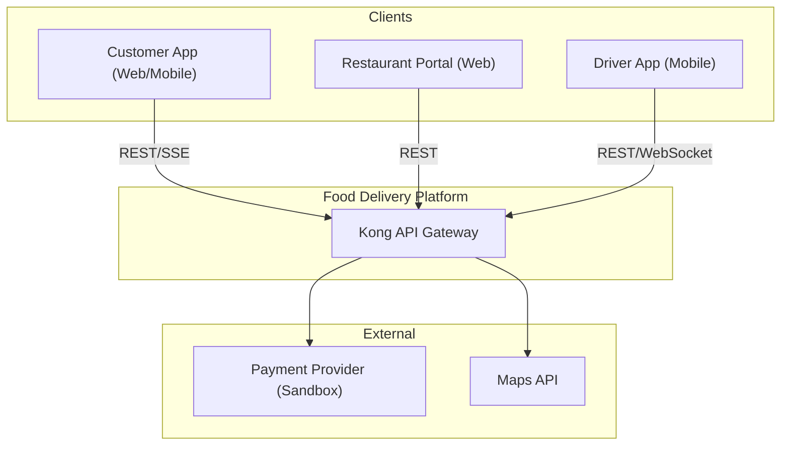

## 1.3 Container Diagram (C4 - Level 2)

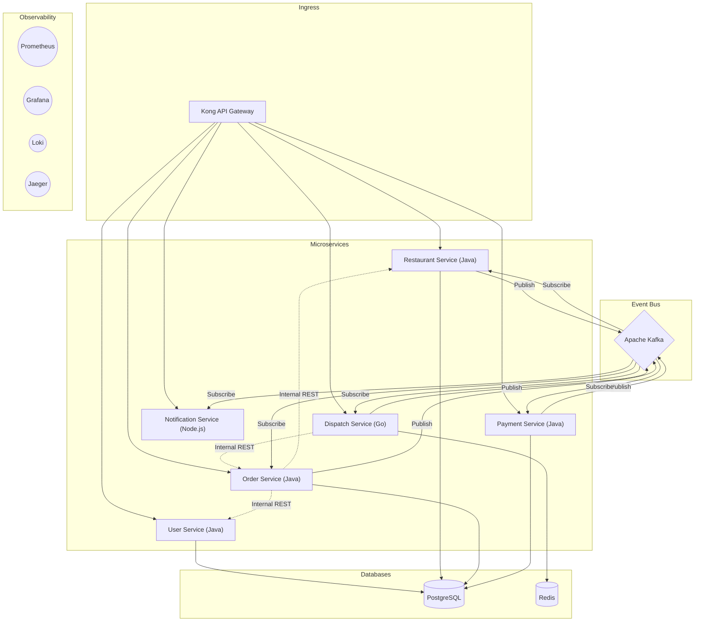

## 1.4 Communication Patterns

### Synchronous (Request-Response)
- **Client → Gateway:** REST over HTTPS (JSON). All user-facing operations.
- **Service → Service (Query):** Internal REST via K8s Service DNS (e.g., `http://restaurant-service:8080/api/internal/...`). Used when Service A needs to query data from Service B immediately.

### Asynchronous (Event-Driven)
- **Service → Service (State Change):** Kafka Events. Used when a business event occurs and other services need to react.

### Real-time (Push to Client)
- **Server-Sent Events (SSE):** Customer tracks order status (unidirectional, simple).
- **WebSocket:** Driver sends GPS coordinates continuously to Dispatch Service (bidirectional).

| Pattern | Protocol | Use Case | Latency |
|---------|----------|----------|---------|
| REST (External) | HTTPS | Client API calls qua Kong | ~50-200ms |
| REST (Internal) | HTTP | Service-to-service queries qua K8s DNS | ~5-30ms |
| Kafka | TCP | Async events giữa services | ~10-100ms |
| SSE | HTTPS | Order status push to customer | ~50ms |
| WebSocket | WSS | Driver GPS stream | ~10ms |

## 1.5 API Gateway (Kong) - Chi tiết

Kong đóng vai trò là **Single Entry Point** của toàn hệ thống:

| Function | Kong Plugin | Description |
|-----------|------------|-------|
| Authentication | jwt | Centralized JWT token validation |
| Rate Limiting | rate-limiting | Rate limit per user or IP |
| Request Routing | Ingress Rules | Route `/api/v1/orders/*` → Order Service |
| CORS | cors | Allow cross-origin from client apps |
| Logging | file-log, tcp-log | Centralized access logging |
| Metrics | prometheus | Export request metrics |
| Tracing | opentelemetry | Inject TraceID into all requests |

### Routing Table

```
/api/v1/auth/**        → User Service
/api/v1/users/**       → User Service
/api/v1/restaurants/** → Restaurant Service
/api/v1/orders/**      → Order Service
/api/v1/payments/**    → Payment Service
/api/v1/delivery/**    → Dispatch Service
/ws/tracking/**        → Notification Service (WebSocket Upgrade)
/sse/orders/**         → Notification Service (SSE)
```

### Internal Service Communication (K8s DNS)

Services communicate internally via K8s Service DNS, bypassing Kong:

```
Order Service  → http://restaurant-service.food-app.svc:8080/api/internal/restaurants/{id}/validate-items
Order Service  → http://user-service.food-app.svc:8080/api/internal/users/{id}
Dispatch Svc   → http://order-service.food-app.svc:8080/api/internal/orders/{id}
```

> [!NOTE]
> Internal endpoints are only accessible within the K8s cluster (not routed via Kong). Protected by Kubernetes NetworkPolicy.
# Part 2: Domain, Internal Architecture & Microservices

## 2.1 DDD Bounded Contexts

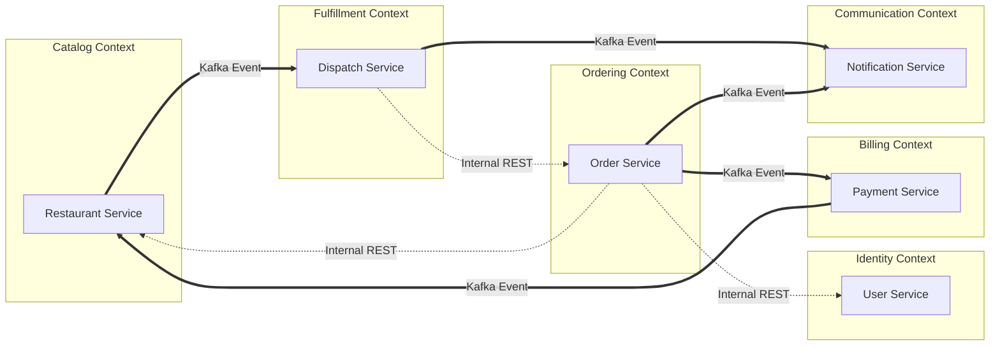

---

## 2.2 Internal Architecture Strategy

Each microservice has a different level of business complexity, therefore we apply an appropriate internal architecture pattern instead of a one-size-fits-all approach:

| Service | Complexity | Pattern | Reason |
|---------|-----------|---------|------------|
| Order Service | **High** (State Machine, Saga, Outbox) | **Hexagonal (Ports & Adapters)** | Complex domain logic separated from infra. 100% testable without Spring Context |
| Payment Service | **Medium-High** (Compensating Tx, External Provider) | **Hexagonal (Ports & Adapters)** | Payment provider can change (Stripe→Mock). Port pattern allows easy adapter swapping |
| User Service | **Low** (CRUD + Auth) | **Simplified Layered** | Simple logic, Spring Security handles the complex parts. Hexagonal would be over-engineering |
| Restaurant Service | **Low** (CRUD + JSONB) | **Simplified Layered** | Mostly CRUD operations on menu data |
| Dispatch Service | **Medium** (Matching Algorithm) | **Idiomatic Go (Clean separation)** | Go conventions with matching algorithm separated into pure functions |
| Notification Service | **Low** (Consume → Push) | **Simple Modular** | Very simple, does not need complex architecture |

### Hexagonal Architecture (Order & Payment Services)

Core principle: **Domain layer MUST NOT depend on any frameworks** — no Spring annotations, no JPA, no Kafka imports. Pure Java only.

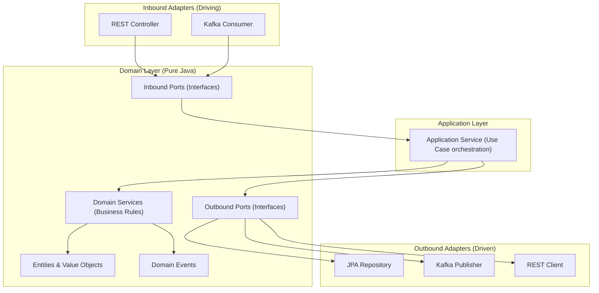

### Simplified Layered (User & Restaurant Services)

Traditional architecture but strictly adhered to: each layer only calls the layer directly below it.

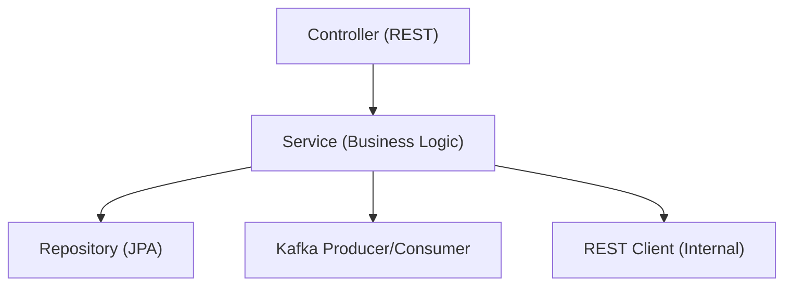

---

## 2.3 User / Identity Service

- **Tech:** Java (Spring Boot) + PostgreSQL
- **Internal Architecture:** Simplified Layered
- **Language:** Java (Spring Boot)

### Package Structure

```
src/main/java/com/fooddelivery/user/
├── UserServiceApplication.java
├── config/                    # Spring Security, JWT config, Bean definitions
├── controller/                # @RestController - External & Internal endpoints
│   ├── AuthController.java
│   ├── UserController.java
│   └── InternalUserController.java    # /api/internal/** endpoints
├── service/                   # Business logic
│   ├── AuthService.java               # Login, register, token management
│   └── UserService.java               # Profile CRUD
├── repository/                # Spring Data JPA
│   ├── UserRepository.java
│   ├── AddressRepository.java
│   └── DriverProfileRepository.java
├── model/                     # JPA Entities
│   ├── User.java
│   ├── Address.java
│   └── DriverProfile.java
├── dto/                       # Request/Response objects
│   ├── LoginRequest.java
│   ├── RegisterRequest.java
│   └── UserResponse.java
├── security/                  # JWT filter, token provider
│   ├── JwtTokenProvider.java
│   └── JwtAuthenticationFilter.java
├── kafka/                     # Kafka (nếu cần publish user events)
├── exception/                 # @ControllerAdvice global error handling
│   ├── GlobalExceptionHandler.java
│   └── ResourceNotFoundException.java
└── common/                    # Shared utilities
    └── ApiResponse.java               # Standard response wrapper
```

### Database Schema

```sql
CREATE TABLE users (
    id UUID PRIMARY KEY DEFAULT gen_random_uuid(),
    email VARCHAR(255) UNIQUE NOT NULL,
    password_hash VARCHAR(255) NOT NULL,
    full_name VARCHAR(255) NOT NULL,
    phone VARCHAR(20),
    role VARCHAR(20) NOT NULL CHECK (role IN ('CUSTOMER','DRIVER','RESTAURANT_OWNER','ADMIN')),
    is_active BOOLEAN DEFAULT true,
    created_at TIMESTAMP DEFAULT NOW(),
    updated_at TIMESTAMP DEFAULT NOW()
);

CREATE TABLE addresses (
    id UUID PRIMARY KEY DEFAULT gen_random_uuid(),
    user_id UUID REFERENCES users(id),
    label VARCHAR(50),
    address_line VARCHAR(500) NOT NULL,
    lat DOUBLE PRECISION NOT NULL,
    lng DOUBLE PRECISION NOT NULL,
    is_default BOOLEAN DEFAULT false
);

CREATE TABLE driver_profiles (
    user_id UUID PRIMARY KEY REFERENCES users(id),
    vehicle_type VARCHAR(20),
    license_plate VARCHAR(20),
    is_verified BOOLEAN DEFAULT false,
    avg_rating DECIMAL(2,1) DEFAULT 5.0
);
```

### API Endpoints

| Method | Endpoint | Auth | Description |
|--------|----------|------|--------|
| POST | `/api/v1/auth/register` | Public | Register |
| POST | `/api/v1/auth/login` | Public | Login, returns JWT |
| POST | `/api/v1/auth/refresh` | Public | Refresh token |
| GET | `/api/v1/users/me` | Bearer | Get profile |
| PUT | `/api/v1/users/me` | Bearer | Update profile |
| GET | `/api/v1/users/me/addresses` | Bearer | List addresses |
| POST | `/api/v1/users/me/addresses` | Bearer | Add address |
| **GET** | **`/api/internal/users/{id}`** | **Internal** | **Called by Order Service** |

---

## 2.4 Restaurant & Catalog Service

- **Tech:** Java (Spring Boot) + PostgreSQL (JSONB)
- **Internal Architecture:** Simplified Layered
- **Language:** Java (Spring Boot)

### Package Structure

```
src/main/java/com/fooddelivery/restaurant/
├── RestaurantServiceApplication.java
├── config/
├── controller/
│   ├── RestaurantController.java
│   ├── MenuController.java
│   └── InternalRestaurantController.java
├── service/
│   ├── RestaurantService.java
│   └── MenuService.java
├── repository/
│   ├── RestaurantRepository.java
│   ├── MenuCategoryRepository.java
│   └── MenuItemRepository.java
├── model/
│   ├── Restaurant.java
│   ├── MenuCategory.java
│   └── MenuItem.java               # options field: @Type(JsonBinaryType.class)
├── dto/
├── kafka/
│   ├── RestaurantEventProducer.java   # Publish OrderAccepted, OrderReadyForPickup
│   └── PaymentEventConsumer.java      # Consume PaymentSuccess → notify restaurant
├── exception/
└── common/
```

### Database Schema

```sql
CREATE TABLE restaurants (
    id UUID PRIMARY KEY DEFAULT gen_random_uuid(),
    owner_id UUID NOT NULL,
    name VARCHAR(255) NOT NULL,
    description TEXT,
    address_line VARCHAR(500) NOT NULL,
    lat DOUBLE PRECISION NOT NULL,
    lng DOUBLE PRECISION NOT NULL,
    cuisine_types VARCHAR(50)[] DEFAULT '{}',
    operating_hours JSONB NOT NULL DEFAULT '{}',
    is_active BOOLEAN DEFAULT true,
    avg_rating DECIMAL(2,1) DEFAULT 0.0,
    total_reviews INTEGER DEFAULT 0,
    created_at TIMESTAMP DEFAULT NOW(),
    updated_at TIMESTAMP DEFAULT NOW()
);

CREATE TABLE menu_categories (
    id UUID PRIMARY KEY DEFAULT gen_random_uuid(),
    restaurant_id UUID REFERENCES restaurants(id) ON DELETE CASCADE,
    name VARCHAR(100) NOT NULL,
    sort_order INTEGER DEFAULT 0
);

CREATE TABLE menu_items (
    id UUID PRIMARY KEY DEFAULT gen_random_uuid(),
    category_id UUID REFERENCES menu_categories(id) ON DELETE CASCADE,
    restaurant_id UUID REFERENCES restaurants(id) ON DELETE CASCADE,
    name VARCHAR(255) NOT NULL,
    description TEXT,
    price DECIMAL(12,2) NOT NULL,
    image_url VARCHAR(500),
    is_available BOOLEAN DEFAULT true,
    options JSONB DEFAULT '[]',
    created_at TIMESTAMP DEFAULT NOW()
);
```

### API Endpoints

| Method | Endpoint | Auth | Description |
|--------|----------|------|--------|
| GET | `/api/v1/restaurants` | Public | List/Search |
| GET | `/api/v1/restaurants/{id}` | Public | Details |
| GET | `/api/v1/restaurants/{id}/menu` | Public | Menu |
| POST | `/api/v1/restaurants` | Owner | Create new |
| PUT | `/api/v1/restaurants/{id}/menu` | Owner | Update menu |
| PATCH | `/api/v1/restaurants/{id}/status` | Owner | Open/close |
| **POST** | **`/api/internal/restaurants/{id}/validate-items`** | **Internal** | **Called by Order Service** |

---

## 2.5 Order Service (Core Business)

- **Tech:** Java (Spring Boot) + PostgreSQL
- **Internal Architecture:** **Hexagonal (Ports & Adapters)**
- **Language:** Java (Spring Boot)

### Package Structure

```
src/main/java/com/fooddelivery/order/

├── domain/                            # 🎯 PURE JAVA - Không có Spring/JPA/Kafka annotations
│   ├── model/
│   │   ├── Order.java                 # Aggregate Root (contains business methods)
│   │   ├── OrderItem.java             # Value Object
│   │   ├── OrderStatus.java           # Enum: CREATED, PAID, PREPARING...
│   │   ├── DeliveryAddress.java       # Value Object
│   │   └── Money.java                 # Value Object (amount + currency)
│   ├── event/
│   │   ├── OrderCreatedEvent.java     # Domain Event POJO
│   │   ├── OrderCancelledEvent.java
│   │   └── OrderStatusChangedEvent.java
│   ├── service/
│   │   └── OrderDomainService.java    # Complex business rules spanning multiple entities
│   │       # VD: validateOrderTransition(order, newStatus) → throws InvalidTransitionException
│   │       #     calculateDeliveryFee(distance) → Money
│   └── port/
│       ├── inbound/                   # USE CASES - interfaces mà Application layer implements
│       │   ├── CreateOrderUseCase.java        # Input: CreateOrderCommand → Output: OrderId
│       │   ├── CancelOrderUseCase.java
│       │   ├── UpdateOrderStatusUseCase.java
│       │   └── GetOrderQuery.java             # Input: orderId → Output: OrderResponse
│       └── outbound/                  # DRIVEN PORTS - interfaces mà Adapters implements
│           ├── OrderRepository.java           # save(), findById() - không phải JPA!
│           ├── EventPublisher.java            # publish(DomainEvent)
│           ├── RestaurantClient.java          # validateItems(restaurantId, items)
│           └── UserClient.java                # getUserById(userId)
│
├── application/                       # 🔌 USE CASE IMPLEMENTATION
│   ├── CreateOrderApplicationService.java     # implements CreateOrderUseCase
│   │   # 1. Call RestaurantClient.validateItems() (outbound port)
│   │   # 2. order = Order.create(...) (domain model)
│   │   # 3. OrderRepository.save(order) (outbound port)
│   │   # 4. EventPublisher.publish(OrderCreatedEvent) (outbound port)
│   ├── CancelOrderApplicationService.java
│   ├── UpdateOrderStatusApplicationService.java
│   └── GetOrderQueryService.java
│
├── adapter/                           # 🔧 INFRASTRUCTURE IMPLEMENTATIONS
│   ├── inbound/
│   │   ├── rest/
│   │   │   ├── OrderController.java           # REST → calls CreateOrderUseCase
│   │   │   ├── InternalOrderController.java   # /api/internal/** for Dispatch Service
│   │   │   ├── CreateOrderRequest.java        # DTO
│   │   │   └── OrderResponseDto.java          # DTO
│   │   └── kafka/
│   │       ├── PaymentEventConsumer.java       # Kafka → calls UpdateOrderStatusUseCase
│   │       ├── RestaurantEventConsumer.java
│   │       └── DeliveryEventConsumer.java
│   └── outbound/
│       ├── persistence/
│       │   ├── JpaOrderRepository.java        # implements OrderRepository port
│       │   ├── OrderJpaEntity.java            # JPA Entity (khác với Domain Model!)
│       │   ├── OrderMapper.java               # Domain ↔ JPA Entity mapping
│       │   └── SpringDataOrderRepository.java # extends JpaRepository
│       ├── messaging/
│       │   ├── KafkaEventPublisher.java       # implements EventPublisher port
│       │   └── OutboxEventRelay.java          # Polls outbox_events table → publishes to Kafka
│       └── rest/
│           ├── RestaurantRestClient.java      # implements RestaurantClient port
│           └── UserRestClient.java            # implements UserClient port
│
└── config/                            # Spring Boot wiring
    ├── BeanConfig.java                # @Bean definitions connecting ports ↔ adapters
    └── KafkaConfig.java
```

> [!IMPORTANT]
> **Rules nghiêm ngặt cho `domain/` package:**
> - Không `import org.springframework.*`
> - Không `import javax.persistence.*`
> - Không `import org.apache.kafka.*`
> - Chỉ import `java.*` standard library và các class trong chính `domain/`
> - Unit test cho domain/ chạy trong < 1 giây vì không cần Application Context

### Order State Machine

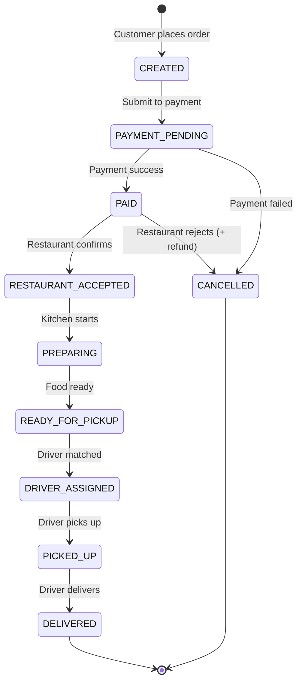

### Database Schema

```sql
CREATE TABLE orders (
    id UUID PRIMARY KEY DEFAULT gen_random_uuid(),
    customer_id UUID NOT NULL,
    restaurant_id UUID NOT NULL,
    delivery_address JSONB NOT NULL,
    items JSONB NOT NULL,
    subtotal DECIMAL(12,2) NOT NULL,
    delivery_fee DECIMAL(12,2) NOT NULL,
    total_amount DECIMAL(12,2) NOT NULL,
    status VARCHAR(30) NOT NULL DEFAULT 'CREATED',
    driver_id UUID,
    special_instructions TEXT,
    estimated_delivery_time TIMESTAMP,
    created_at TIMESTAMP DEFAULT NOW(),
    updated_at TIMESTAMP DEFAULT NOW()
);

CREATE TABLE outbox_events (
    id UUID PRIMARY KEY DEFAULT gen_random_uuid(),
    aggregate_type VARCHAR(50) NOT NULL,
    aggregate_id UUID NOT NULL,
    event_type VARCHAR(50) NOT NULL,
    payload JSONB NOT NULL,
    published BOOLEAN DEFAULT false,
    created_at TIMESTAMP DEFAULT NOW()
);
```

### API Endpoints

| Method | Endpoint | Auth | Description |
|--------|----------|------|--------|
| POST | `/api/v1/orders` | Customer | Create order |
| GET | `/api/v1/orders/{id}` | Bearer | Order details |
| GET | `/api/v1/orders` | Bearer | Order history |
| PATCH | `/api/v1/orders/{id}/cancel` | Customer | Cancel order |
| PATCH | `/api/v1/orders/{id}/accept` | Owner | Restaurant confirms |
| PATCH | `/api/v1/orders/{id}/ready` | Owner | Food is ready |
| **GET** | **`/api/internal/orders/{id}`** | **Internal** | **Called by Dispatch Service** |

---

## 2.6 Payment Service

- **Tech:** Java (Spring Boot) + PostgreSQL
- **Internal Architecture:** **Hexagonal (Ports & Adapters)**
- **Language:** Java (Spring Boot)

### Package Structure

```
src/main/java/com/fooddelivery/payment/

├── domain/                            # 🎯 PURE JAVA
│   ├── model/
│   │   ├── Payment.java               # Aggregate Root
│   │   ├── PaymentStatus.java         # PENDING, PROCESSING, SUCCESS, FAILED, REFUNDED
│   │   ├── PaymentMethod.java         # CREDIT_CARD, WALLET, COD
│   │   └── Refund.java
│   ├── event/
│   │   ├── PaymentSuccessEvent.java
│   │   ├── PaymentFailedEvent.java
│   │   └── PaymentRefundedEvent.java
│   ├── service/
│   │   └── PaymentDomainService.java  # Validate amount, check refund eligibility
│   └── port/
│       ├── inbound/
│       │   ├── ProcessPaymentUseCase.java
│       │   └── RefundPaymentUseCase.java
│       └── outbound/
│           ├── PaymentRepository.java
│           ├── PaymentGateway.java     # 👈 Swap adapter: Stripe ↔ VNPay ↔ Mock
│           └── EventPublisher.java
│
├── application/
│   ├── ProcessPaymentApplicationService.java
│   └── RefundPaymentApplicationService.java
│
├── adapter/
│   ├── inbound/
│   │   ├── rest/
│   │   │   └── PaymentController.java
│   │   └── kafka/
│   │       ├── OrderEventConsumer.java        # OrderCreated → process payment
│   │       └── CompensationEventConsumer.java # OrderRejected/DispatchFailed → refund
│   └── outbound/
│       ├── persistence/
│       │   └── JpaPaymentRepository.java
│       ├── messaging/
│       │   └── KafkaEventPublisher.java
│       └── gateway/
│           ├── MockPaymentGateway.java        # implements PaymentGateway (dev/test)
│           └── StripePaymentGateway.java      # implements PaymentGateway (prod)
│
└── config/
```

> [!TIP]
> **Hexagonal giải quyết bài toán quan trọng ở Payment:** `PaymentGateway` là một **outbound port** (interface). Khi dev/test dùng `MockPaymentGateway`, khi production swap sang `StripePaymentGateway` — chỉ cần thay đổi config Bean, không sửa business logic.

### Database Schema

```sql
CREATE TABLE payments (
    id UUID PRIMARY KEY DEFAULT gen_random_uuid(),
    order_id UUID NOT NULL UNIQUE,
    customer_id UUID NOT NULL,
    amount DECIMAL(12,2) NOT NULL,
    currency VARCHAR(3) DEFAULT 'VND',
    method VARCHAR(20) NOT NULL,
    status VARCHAR(20) NOT NULL DEFAULT 'PENDING',
    provider_transaction_id VARCHAR(255),
    failure_reason TEXT,
    created_at TIMESTAMP DEFAULT NOW(),
    updated_at TIMESTAMP DEFAULT NOW()
);

CREATE TABLE refunds (
    id UUID PRIMARY KEY DEFAULT gen_random_uuid(),
    payment_id UUID REFERENCES payments(id),
    amount DECIMAL(12,2) NOT NULL,
    reason TEXT,
    status VARCHAR(20) DEFAULT 'PENDING',
    created_at TIMESTAMP DEFAULT NOW()
);
```

### API Endpoints

| Method | Endpoint | Auth | Description |
|--------|----------|------|--------|
| GET | `/api/v1/payments/{orderId}` | Bearer | Payment status |
| POST | `/api/v1/payments/{id}/refund` | Admin | Manual refund |

---

## 2.7 Dispatch Service (Real-time)

- **Tech:** Go + Redis (Geospatial)
- **Internal Architecture:** Idiomatic Go (Clean separation)
- **Language:** Go

### Directory Structure

```
dispatch-service/
├── cmd/
│   └── server/
│       └── main.go                    # Entry point: wire dependencies, start server
├── internal/
│   ├── domain/                        # 🎯 Core types (thuần Go, không import 3rd-party)
│   │   ├── driver.go                  # Driver struct, DriverStatus
│   │   ├── dispatch.go                # DispatchResult, DispatchStatus
│   │   └── location.go                # Coordinates value object
│   ├── matching/                      # 🧠 Core algorithm (pure Go functions)
│   │   ├── matcher.go                 # FindNearestDriver(center, radius, drivers) → Driver
│   │   └── matcher_test.go            # Unit test không cần Redis/Kafka
│   ├── handler/                       # Inbound adapters
│   │   ├── http.go                    # REST endpoints (/api/v1/delivery/*)
│   │   ├── websocket.go              # WebSocket handler (driver location stream)
│   │   └── middleware.go              # Auth, logging middleware
│   ├── service/                       # Application logic (orchestrates domain + infra)
│   │   └── dispatch_service.go        # Uses matching + redis + kafka
│   ├── repository/                    # Outbound: Redis operations
│   │   ├── driver_repo.go            # GEOADD, GEORADIUS, HSET/HGET
│   │   └── driver_repo_test.go
│   ├── kafka/                         # Outbound: Kafka consumer/producer
│   │   ├── consumer.go               # Consume OrderReadyForPickup
│   │   └── producer.go               # Publish DriverAssigned
│   ├── client/                        # Outbound: REST client
│   │   └── order_client.go           # GET http://order-service/api/internal/orders/{id}
│   └── config/
│       └── config.go                  # Environment-based config loading
├── Dockerfile
├── go.mod
├── go.sum
└── skaffold.yaml
```

> [!NOTE]
> `internal/matching/` contains **pure Go functions** that do not depend on Redis or any other infra. Input is a slice of `[]Driver`, output is `*Driver`. Unit tests run instantly.

### Redis Data Structures

```
GEOADD active_drivers {lng} {lat} {driver_id}
HSET driver:{driver_id} status "AVAILABLE" last_seen "2026-..."
SET dispatch:order:{order_id} {driver_id} EX 3600
```

### Matching Algorithm Flow

```
1. Receive "OrderReadyForPickup" from Kafka
2. GET restaurant coords from event payload
3. GEORADIUS active_drivers {lng} {lat} 3km ASC COUNT 10
4. Filter: status == "AVAILABLE"
5. Select nearest → HSET status "ASSIGNED"
6. Publish "DriverAssigned" to Kafka
7. No driver → retry 30s (max 5) → "DispatchFailed"
```

### Endpoints

| Method | Endpoint | Auth | Description |
|--------|----------|------|--------|
| WebSocket | `/ws/driver/location` | Driver JWT | GPS stream (5s) |
| GET | `/api/v1/delivery/{orderId}` | Bearer | Delivery status + location |
| PATCH | `/api/v1/delivery/{orderId}/pickup` | Driver | Driver picked up |
| PATCH | `/api/v1/delivery/{orderId}/deliver` | Driver | Delivered |

---

## 2.8 Notification Service

- **Tech:** Node.js (TypeScript)
- **Internal Architecture:** Simple Modular
- **Language:** Node.js (TypeScript)

### Directory Structure

```
notification-service/src/
├── index.ts                   # Entry point: start Kafka consumers + HTTP server
├── config/
│   └── index.ts               # Environment config
├── kafka/
│   ├── consumer.ts            # KafkaJS consumer setup
│   └── handlers/
│       ├── order-events.ts    # Handle OrderCreated, OrderCancelled
│       ├── payment-events.ts  # Handle PaymentSuccess, PaymentFailed
│       ├── delivery-events.ts # Handle DriverAssigned, OrderDelivered
│       └── restaurant-events.ts
├── sse/
│   ├── manager.ts             # Manage active SSE connections per orderId
│   └── handler.ts             # GET /sse/orders/{orderId}/status endpoint
├── websocket/
│   └── handler.ts             # WebSocket push (if needed)
└── types/
    └── events.ts              # TypeScript interfaces for Kafka event payloads
```

### Event Subscriptions

| Topic | Event | Action |
|-------|-------|--------|
| `order-events` | OrderCreated | Push order processing to Customer |
| `payment-events` | PaymentSuccess | Push payment success to Customer |
| `restaurant-events` | OrderAccepted | Push restaurant accepted to Customer |
| `delivery-events` | DriverAssigned | Push driver info to Customer |
| `delivery-events` | OrderDelivered | Push delivery completed to Customer |

---

## 2.9 Overall Database ERD

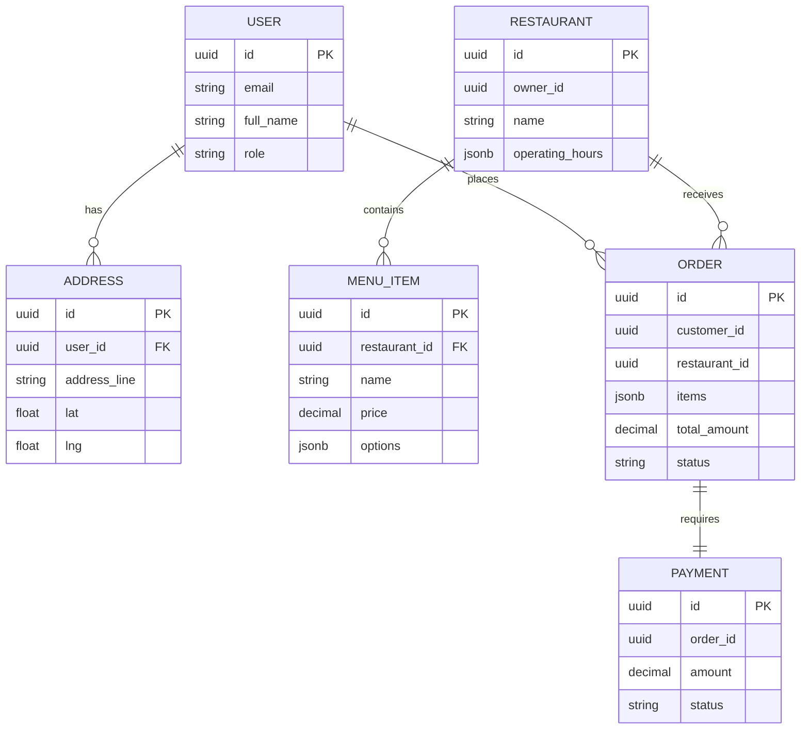
# Part 3: Event-Driven Architecture & Saga Pattern

## 3.1 Kafka Topics & Event Schema

### Topic Registry

| Topic Name | Partitions | Retention | Producer | Consumers |
|------------|-----------|-----------|----------|-----------|
| `order-events` | 6 | 7 days | Order Service | Payment, Notification |
| `payment-events` | 6 | 7 days | Payment Service | Order, Restaurant, Notification |
| `restaurant-events` | 6 | 7 days | Restaurant Service | Order, Dispatch, Notification |
| `delivery-events` | 6 | 7 days | Dispatch Service | Order, Notification |

### Event Envelope (CloudEvents Standard)

```json
{
  "id": "evt-uuid-001",
  "source": "order-service",
  "type": "OrderCreated",
  "time": "2026-04-06T10:00:00Z",
  "datacontenttype": "application/json",
  "data": {
    "order_id": "ord-uuid-123",
    "customer_id": "usr-uuid-456",
    "restaurant_id": "rst-uuid-789",
    "total_amount": 120000,
    "items": [
      { "item_id": "item-001", "name": "Phở Bò Tái", "qty": 2, "price": 55000 }
    ]
  }
}
```

### Event Catalog

| Event Type | Topic | Payload chính | Trigger |
|-----------|-------|---------------|---------|
| `OrderCreated` | order-events | order_id, customer_id, restaurant_id, total, items | Customer places order |
| `OrderCancelled` | order-events | order_id, reason, cancelled_by | Customer or system cancels |
| `PaymentSuccess` | payment-events | order_id, payment_id, transaction_id | Payment success |
| `PaymentFailed` | payment-events | order_id, payment_id, failure_reason | Payment failed |
| `OrderAccepted` | restaurant-events | order_id, restaurant_id, estimated_prep_time | Restaurant confirms |
| `OrderRejected` | restaurant-events | order_id, restaurant_id, reason | Restaurant rejected |
| `OrderReadyForPickup` | restaurant-events | order_id, restaurant_id | Food is ready |
| `DriverAssigned` | delivery-events | order_id, driver_id, driver_name, eta | Driver assigned |
| `DriverPickedUp` | delivery-events | order_id, driver_id | Driver picked up |
| `OrderDelivered` | delivery-events | order_id, driver_id, delivered_at | Delivery completed |
| `DispatchFailed` | delivery-events | order_id, reason | No driver available |

---

## 3.2 Saga: Order Fulfillment (Choreography)

### Happy Path

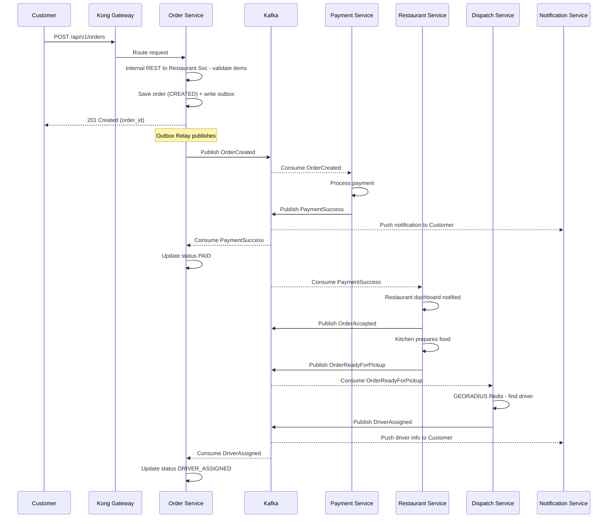

### Failure: Payment Failed

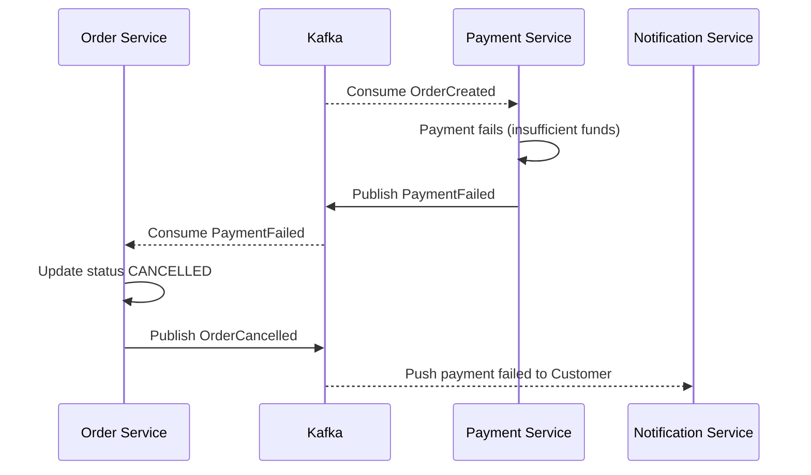

### Failure: Restaurant Rejects

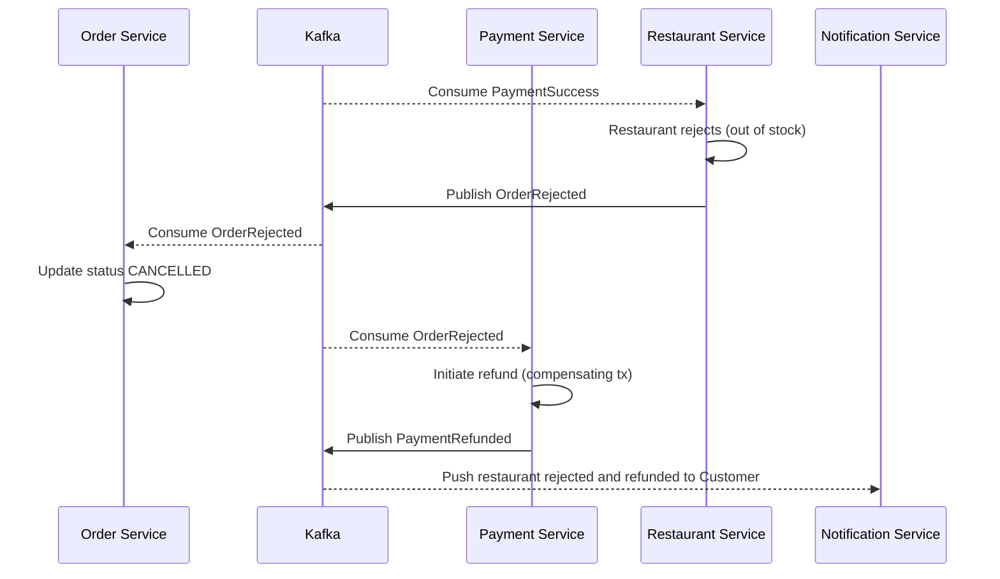

### Failure: No Driver Available

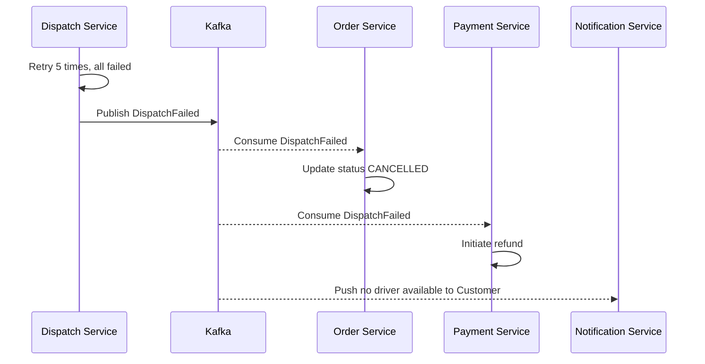

---

## 3.3 Transactional Outbox Pattern

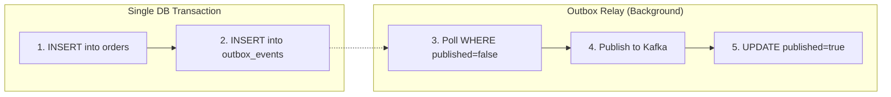

---

## 3.4 Error Handling & Resilience

| Pattern | Applied to | Description |
|---------|---------|-------|
| **Idempotent Consumer** | Kafka consumers | Store processed `event_id`, skip if duplicate |
| **Dead Letter Queue** | Kafka | Failed events after N retries moved to DLQ |
| **Circuit Breaker** | Internal REST calls | Resilience4j (Java) / custom (Go) |
| **Retry with Backoff** | Kafka, REST | Exponential: 1s, 2s, 4s... max 5 |
| **Timeout** | All remote calls | REST internal: 3s, Kafka publish: 5s |
| **Graceful Degradation | Dispatch Svc | No driver available → notify, no crash |
# Part 4: DevOps & Infrastructure (Production-Grade on Azure)

## 4.1 Azure Infrastructure

### Azure Services Used

| Service | Purpose | Cost Estimate |
|---------|---------|--------------|
| **AKS** (Azure Kubernetes Service) | K8s cluster | Control plane: **Free**. Nodes: ~$30-60/mo |
| **ACR** (Azure Container Registry) | Docker image registry | Basic tier: ~$5/mo |
| **Azure** | Free credits | Free tier credits |

### AKS Cluster Specification

| Config | Value | Reason |
|--------|-------|-------|
| Node Pool | 2-3 nodes, Standard_B2s (2 vCPU, 4GB) | Sufficient for dev/demo, cost-effective |
| K8s Version | Latest stable (1.29+) | Security patches |
| Network Plugin | Azure CNI (or kubenet) | Standard networking |
| Node Autoscaler | Enabled (min: 2, max: 4) | Scale when needed |

### Namespace Strategy

| Namespace | Contains |
|-----------|------|
| `food-app` | Microservices + Kong |
| `kafka` | Kafka brokers (Strimzi operator) |
| `databases` | PostgreSQL, Redis |
| `observability` | Prometheus, Grafana, Loki, Jaeger |
| `argocd` | ArgoCD server |

### Infrastructure Stack (Self-hosted on K8s)

| Component | Helm Chart / Operator | Notes |
|-----------|----------------------|-------|
| PostgreSQL | Bitnami/postgresql | 1 instance, multiple databases (user_db, order_db, etc.) |
| Redis | Bitnami/redis | Single instance, used for Geo + Cache |
| Kafka | Strimzi Kafka Operator | 1 broker (dev), can scale to 3 (prod) |
| Kong | Kong/ingress | Ingress Controller mode |

> [!NOTE]
> To save resources on the development environment, PostgreSQL runs a single instance with multiple databases (logical separation) instead of 1 instance per service. This still ensures the Database-per-Service principle at the schema level.

---

## 4.2 K8s Resource Requirements

| Service | CPU Req | CPU Lim | Mem Req | Mem Lim | Replicas |
|---------|---------|---------|---------|---------|----------|
| User Service | 200m | 500m | 256Mi | 512Mi | 1 |
| Restaurant Service | 200m | 500m | 256Mi | 512Mi | 1 |
| Order Service | 300m | 500m | 256Mi | 512Mi | 1-2 |
| Payment Service | 200m | 500m | 256Mi | 512Mi | 1 |
| Dispatch Service | 200m | 500m | 64Mi | 128Mi | 1-2 |
| Notification Service | 200m | 500m | 64Mi | 128Mi | 1 |
| Kong Gateway | 300m | 500m | 128Mi | 256Mi | 1 |

### Health Checks (Required for all services)

- **Liveness Probe:** `GET /health/live` → K8s restarts pod if failed
- **Readiness Probe:** `GET /health/ready` → K8s stops routing traffic if failed

---

## 4.3 CI/CD Pipeline

### CI (GitHub Actions) - Per Pull Request

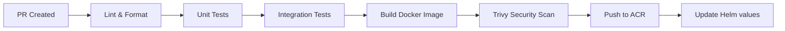

| Step | Java | Go | Node.js |
|------|------|-----|---------|
| Lint | Checkstyle | golangci-lint | ESLint |
| Unit Test | JUnit 5 + Mockito | go test + testify | Jest |
| Integration Test | Testcontainers | Testcontainers | Testcontainers |
| Docker Build | Multi-stage (Maven + JRE) | Multi-stage (build + scratch) | Multi-stage (build + node-slim) |
| Security Scan | Trivy | Trivy | Trivy |

### CD (GitOps - ArgoCD)

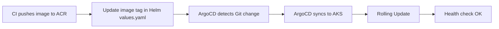

**ArgoCD Config:**
- Auto-sync enabled, self-heal enabled
- Rolling Update (maxSurge=1, maxUnavailable=0)
- 1-click rollback on failure

---

## 4.4 Local Development Environment

```bash
# One-command setup
make local-setup      # Start Kind cluster + install Kafka, PostgreSQL, Redis, Kong

# Development
make dev svc=order    # Skaffold watches & auto-deploys order-service

# Utilities
make logs svc=order   # Tail logs
make test svc=order   # Run tests
make lint svc=order   # Run linter
```

| Tool | Purpose |
|------|---------|
| Kind | Local K8s cluster (runs in Docker) |
| Skaffold | Watch code → build → auto-deploy |
| Helm | Install infrastructure charts |
| kubectl | Interact with cluster |

---

## 4.5 Observability Stack

### Three Pillars

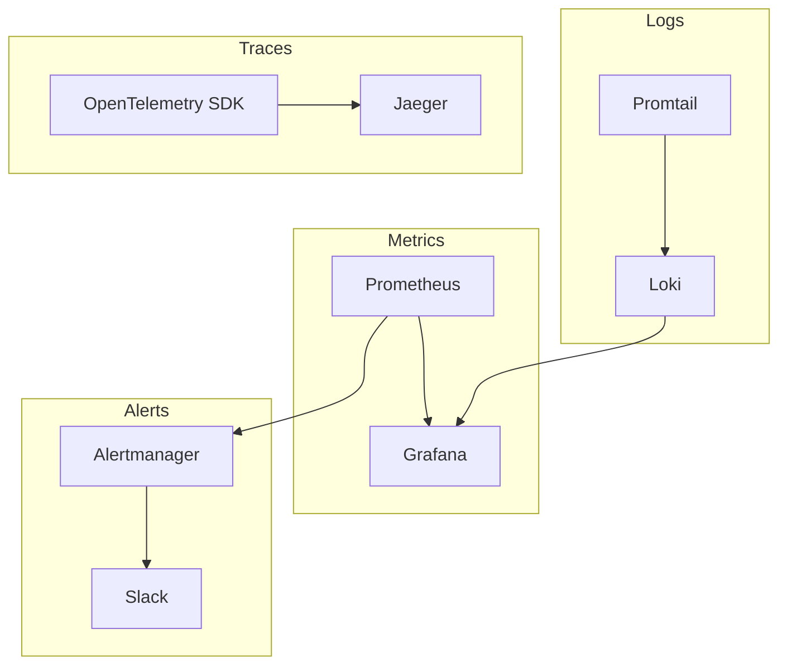

### Metrics (Prometheus + Grafana)

Each service exposes `GET /metrics`:

| Category | Metrics | Source |
|----------|---------|-------|
| RED | `http_requests_total`, `http_request_duration_seconds` | Kong + Services |
| Runtime | `jvm_memory_used_bytes`, `go_goroutines` | Spring Actuator, Go runtime |
| Business | `orders_created_total`, `payment_failures_total` | Custom counters |
| Kafka | `kafka_consumer_lag` | Kafka Exporter |

### Logging (Structured JSON - required)

```json
{
  "timestamp": "2026-04-06T10:00:00Z",
  "level": "INFO",
  "service": "order-service",
  "trace_id": "abc123",
  "message": "Order created",
  "order_id": "ord-123"
}
```

### Distributed Tracing (OpenTelemetry + Jaeger)

A request trace across the system:

```
Trace: abc123
├── Kong Gateway (2ms)
├── Order Service (15ms)
│   ├── Internal REST → Restaurant Service (8ms)
│   └── PostgreSQL INSERT (3ms)
├── Kafka Publish (2ms)
├── Payment Service (200ms)
└── Notification Service (5ms)
```

---

## 4.6 Security

### Authentication Flow

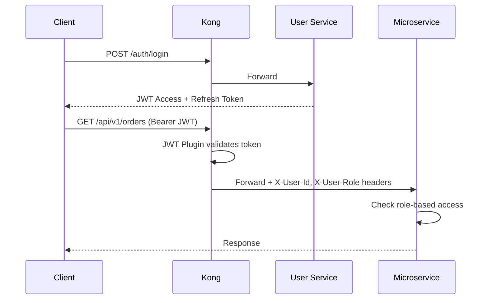

### Security Measures

| Category | Measure |
|----------|---------|
| Transport | TLS at Kong (HTTPS) |
| Auth | JWT validation at gateway |
| AuthZ | RBAC at application level |
| Secrets | K8s Secrets (+ Sealed Secrets for Git) |
| API | Rate limiting (100 req/min per user) |
| Images | Trivy scan in CI |
| Network | K8s NetworkPolicy (namespace isolation) |
# Part 5: Repo Structure & Development Standards

## 5.1 Monorepo Directory Structure

```
food-delivery-microservices/
│
├── README.md
├── Makefile                           # make dev, make test, make lint, make local-setup
├── .gitignore
├── .editorconfig
│
├── .github/
│   ├── workflows/
│   │   ├── ci-java.yml                # CI for Java services
│   │   ├── ci-go.yml                  # CI for Go services
│   │   ├── ci-node.yml                # CI for Node.js services
│   │   └── ci-helm.yml                # Validate Helm charts
│   ├── PULL_REQUEST_TEMPLATE.md
│   └── CODEOWNERS
│
├── docs/
│   ├── architecture.md
│   └── adr/
│       ├── 001-monorepo-strategy.md
│       ├── 002-kafka-message-broker.md
│       ├── 003-kong-api-gateway.md
│       ├── 004-internal-rest-over-grpc.md
│       ├── 005-postgresql-jsonb-over-mongodb.md
│       └── 006-hexagonal-for-complex-services.md
│
├── services/
│   │
│   ├── user-service/                  # Java - Simplified Layered
│   │   ├── Dockerfile
│   │   ├── pom.xml
│   │   ├── skaffold.yaml
│   │   └── src/
│   │       ├── main/java/com/fooddelivery/user/
│   │       │   ├── UserServiceApplication.java
│   │       │   ├── config/
│   │       │   ├── controller/
│   │       │   ├── service/
│   │       │   ├── repository/
│   │       │   ├── model/
│   │       │   ├── dto/
│   │       │   ├── security/
│   │       │   ├── kafka/
│   │       │   ├── exception/
│   │       │   └── common/
│   │       └── test/
│   │
│   ├── restaurant-service/            # Java - Simplified Layered
│   │   ├── Dockerfile
│   │   ├── pom.xml
│   │   ├── skaffold.yaml
│   │   └── src/
│   │       ├── main/java/com/fooddelivery/restaurant/
│   │       │   ├── RestaurantServiceApplication.java
│   │       │   ├── config/
│   │       │   ├── controller/
│   │       │   ├── service/
│   │       │   ├── repository/
│   │       │   ├── model/
│   │       │   ├── dto/
│   │       │   ├── kafka/
│   │       │   ├── exception/
│   │       │   └── common/
│   │       └── test/
│   │
│   ├── order-service/                 # Java - Hexagonal Architecture
│   │   ├── Dockerfile
│   │   ├── pom.xml
│   │   ├── skaffold.yaml
│   │   └── src/
│   │       ├── main/java/com/fooddelivery/order/
│   │       │   ├── domain/            # 🎯 Pure Java (NO framework imports)
│   │       │   │   ├── model/         #    Order, OrderItem, OrderStatus, Money
│   │       │   │   ├── event/         #    OrderCreatedEvent, OrderCancelledEvent
│   │       │   │   ├── service/       #    OrderDomainService (business rules)
│   │       │   │   └── port/
│   │       │   │       ├── inbound/   #    CreateOrderUseCase, CancelOrderUseCase
│   │       │   │       └── outbound/  #    OrderRepository, EventPublisher, RestaurantClient
│   │       │   ├── application/       # 🔌 Use Case implementations
│   │       │   ├── adapter/           # 🔧 Infrastructure
│   │       │   │   ├── inbound/
│   │       │   │   │   ├── rest/      #    OrderController, DTOs
│   │       │   │   │   └── kafka/     #    PaymentEventConsumer, DeliveryEventConsumer
│   │       │   │   └── outbound/
│   │       │   │       ├── persistence/  # JpaOrderRepository, JPA Entities, Mappers
│   │       │   │       ├── messaging/    # KafkaEventPublisher, OutboxRelay
│   │       │   │       └── rest/         # RestaurantRestClient, UserRestClient
│   │       │   └── config/
│   │       └── test/
│   │
│   ├── payment-service/               # Java - Hexagonal Architecture
│   │   ├── Dockerfile
│   │   ├── pom.xml
│   │   ├── skaffold.yaml
│   │   └── src/
│   │       ├── main/java/com/fooddelivery/payment/
│   │       │   ├── domain/            # 🎯 Pure Java
│   │       │   │   ├── model/         #    Payment, PaymentStatus, Refund
│   │       │   │   ├── event/         #    PaymentSuccessEvent, PaymentFailedEvent
│   │       │   │   ├── service/       #    PaymentDomainService
│   │       │   │   └── port/
│   │       │   │       ├── inbound/   #    ProcessPaymentUseCase, RefundUseCase
│   │       │   │       └── outbound/  #    PaymentRepository, PaymentGateway, EventPublisher
│   │       │   ├── application/
│   │       │   ├── adapter/
│   │       │   │   ├── inbound/
│   │       │   │   │   ├── rest/
│   │       │   │   │   └── kafka/     #    OrderEventConsumer, CompensationConsumer
│   │       │   │   └── outbound/
│   │       │   │       ├── persistence/
│   │       │   │       ├── messaging/
│   │       │   │       └── gateway/   #    MockPaymentGateway, StripePaymentGateway
│   │       │   └── config/
│   │       └── test/
│   │
│   ├── dispatch-service/              # Go - Idiomatic Clean
│   │   ├── Dockerfile
│   │   ├── go.mod
│   │   ├── go.sum
│   │   ├── skaffold.yaml
│   │   ├── cmd/server/main.go
│   │   └── internal/
│   │       ├── domain/                #    Driver, Location, DispatchResult (pure Go)
│   │       ├── matching/              #    Pure matching algorithm + unit tests
│   │       ├── handler/               #    HTTP + WebSocket handlers
│   │       ├── service/               #    DispatchService (orchestration)
│   │       ├── repository/            #    Redis operations
│   │       ├── kafka/                 #    Consumer + Producer
│   │       ├── client/                #    REST client to Order Service
│   │       └── config/
│   │
│   └── notification-service/          # Node.js TypeScript - Simple Modular
│       ├── Dockerfile
│       ├── package.json
│       ├── tsconfig.json
│       ├── skaffold.yaml
│       └── src/
│           ├── index.ts
│           ├── config/
│           ├── kafka/
│           │   ├── consumer.ts
│           │   └── handlers/          #    Per-topic event handlers
│           ├── sse/
│           │   ├── manager.ts         #    Connection manager
│           │   └── handler.ts
│           ├── websocket/
│           └── types/                 #    TypeScript event interfaces
│
├── deployments/
│   ├── helm/
│   │   ├── Chart.yaml
│   │   ├── values.yaml
│   │   ├── values-dev.yaml
│   │   ├── values-staging.yaml
│   │   ├── values-prod.yaml
│   │   └── charts/
│   │       ├── user-service/
│   │       │   ├── Chart.yaml
│   │       │   ├── values.yaml
│   │       │   └── templates/
│   │       │       ├── deployment.yaml
│   │       │       ├── service.yaml
│   │       │       ├── hpa.yaml
│   │       │       └── configmap.yaml
│   │       ├── order-service/
│   │       ├── restaurant-service/
│   │       ├── payment-service/
│   │       ├── dispatch-service/
│   │       └── notification-service/
│   │
│   ├── argocd/
│   │   ├── application.yaml
│   │   └── applicationset.yaml
│   │
│   ├── infrastructure/
│   │   ├── kafka/                     # Strimzi Kafka operator
│   │   ├── postgresql/               # Bitnami PostgreSQL
│   │   ├── redis/                     # Bitnami Redis
│   │   └── kong/                      # Kong Ingress Controller
│   │
│   └── observability/
│       ├── prometheus/
│       ├── grafana/
│       ├── loki/
│       └── jaeger/
│
└── scripts/
    ├── local-setup.sh
    ├── seed-data.sh
    └── azure-setup.sh
```

---

## 5.2 Coding Conventions

### Java (Spring Boot) - Common for all Java services

| Rule | Standard |
|------|----------|
| Java Version | 21 (LTS) |
| Build Tool | Maven |
| REST Response | `ResponseEntity<ApiResponse<T>>` |
| Error Handling | `@ControllerAdvice` global handler |
| Logging | SLF4J + Logback, structured JSON |
| Testing | JUnit 5 + Mockito + Testcontainers |
| HTTP Client | Spring WebClient (non-blocking) |

### Java - Hexagonal Services (Order & Payment) - Additional rules

| Rule | Standard |
|------|----------|
| Package root | `com.fooddelivery.{service}` |
| Domain package | **DO NOT** import Spring, JPA, Kafka. Only `java.*` |
| Domain Model | Separate from JPA Entity. Use Mapper for conversion |
| Business logic | Place in `domain/service/`, NOT in Application layer |
| Use Case | One use case = 1 interface (inbound port) + 1 implementation (application)
| Testing domain | Pure Java unit tests, run in <1s, no @SpringBootTest required

### Java - Layered Services (User & Restaurant) - Rules

| Rule | Standard |
|------|----------|
| Package root | `com.fooddelivery.{service}` |
| Layers | controller → service → repository (top-down only) |
| Model | JPA Entity used directly, DTOs for request/response |
| Testing | `@SpringBootTest` + Testcontainers for integration tests |

### Go (Dispatch Service)

| Rule | Standard |
|------|----------|
| Go Version | 1.22+ |
| Layout | `cmd/` + `internal/` |
| Error Handling | Explicit error returns, no panic in business logic |
| Logging | `slog` (structured JSON, stdlib) |
| Testing | `go test` + `testify` |
| Linting | `golangci-lint` |
| Domain package | No 3rd-party library imports |

### Node.js (Notification Service)

| Rule | Standard |
|------|----------|
| Node Version | 20 LTS |
| Language | TypeScript (strict mode) |
| Package Manager | npm |
| Logging | `pino` (structured JSON) |
| Testing | Jest |
| Linting | ESLint + Prettier |

---

## 5.3 Git Workflow (GitHub Flow)

```
main (production-ready, protected)
  └── feature/FD-123-add-order-api
  └── feature/FD-124-dispatch-matching
  └── fix/FD-130-payment-timeout
```

### Commit Convention (Conventional Commits)

```
feat(order): add order cancellation endpoint
fix(dispatch): handle redis connection timeout
docs(arch): update saga sequence diagram
chore(ci): add trivy security scan step
test(payment): add refund domain service unit tests
```

### PR Rules

- 1 reviewer approval required
- CI must pass (lint + test)
- PR description: **What** + **Why**
- Squash merge to `main`

---

## 5.4 Implementation Roadmap

| Phase | Name | Week | Deliverables | Owner |
|-------|-----|------|-------------|-------|
| 1 | Architecture & Design | 1-2 | SADD (this document), ADRs | All |
| 2 | Platform Foundation | 2-4 | Repo setup, Local K8s, CI pipeline, Helm charts, Infra | DevOps |
| 3 | Core Services MVP | 4-8 | User auth, Restaurant CRUD, Order (Hexagonal), Payment (Hexagonal) | Backend |
| 4 | Dispatch & Notification | 6-9 | Driver tracking, Matching algorithm, SSE push | DevOps |
| 5 | Integration & Saga | 9-11 | End-to-end flow, Saga compensation, Outbox relay, Error handling | All |
| 6 | Observability & GitOps | 10-12 | Prometheus, Grafana, Loki, Jaeger, ArgoCD, Azure AKS | DevOps |
| 7 | Polish & Demo | 12-14 | Client apps MVP, Load test, Documentation | All |

> [!IMPORTANT]
> Phase 2 and Phase 3 run **in parallel**: Platform setup runs in parallel with User Service implementation (Layered, simplest) → then Order Service (Hexagonal, most complex).

---

## 5.5 Summary of ADRs (Architecture Decision Records)

| # | Decision | Status |
|---|----------|--------|
| ADR-001 | Monorepo Strategy | ✅ Accepted |
| ADR-002 | Apache Kafka as Message Broker | ✅ Accepted |
| ADR-003 | Kong as API Gateway (K8s Ingress) | ✅ Accepted |
| ADR-004 | Internal REST over gRPC | ✅ Accepted |
| ADR-005 | PostgreSQL JSONB over MongoDB | ✅ Accepted |
| ADR-006 | Hexagonal Architecture for Order & Payment Services | ✅ Accepted |

